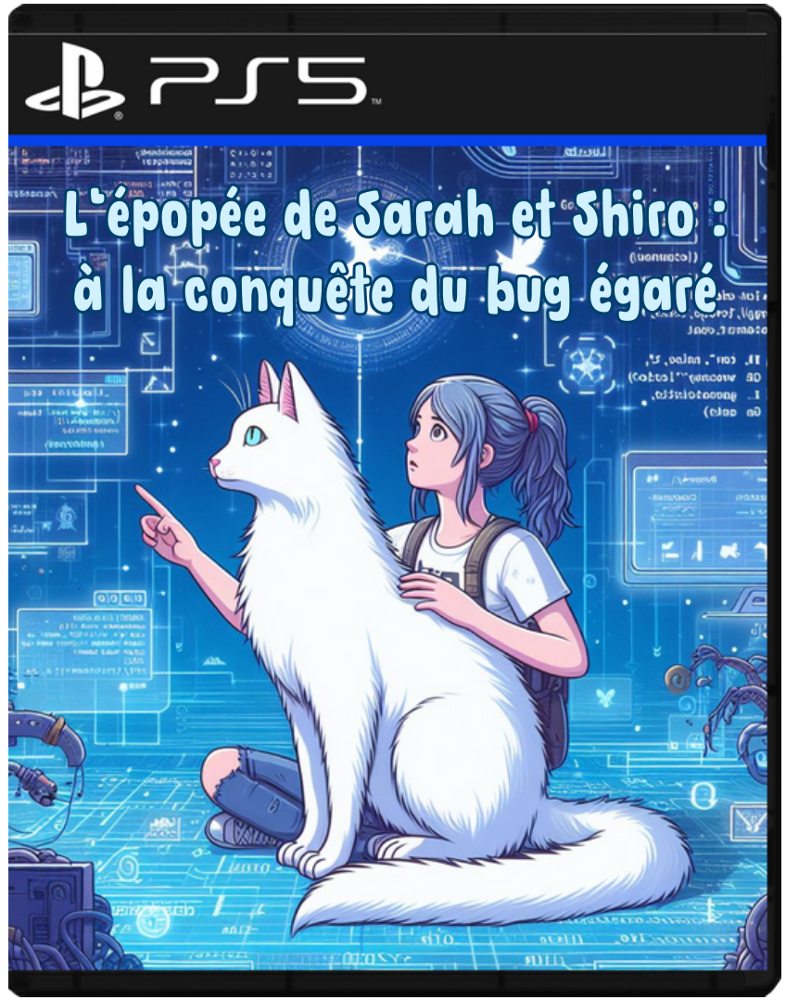

# Sarah Dautricourt, pour vous servir !😋

😉 Je suis actuellement en recherche d'alternance afin d'obtenir un diplôme en développement informatique

💪 J'adore apprendre et découvrir de nouvelle chose, et quoi de mieux que le développement web pour ça !

🎮 J'aime les jeux vidéos, la lecture, la musique, et mon chat, Shiro !

---

## Mes compétences

- HTML 
- CSS 
- Développement d'algorithmes
### 📚 Actuellement en cours d'apprentissage : 
- JavaScript 

---

## Mon parcours

  
Actuellement à la quête d'une entreprise pour mon alternance, je vous laisse découvrir le synopsis du jeu vidéo qui retrace mon histoire :

   
  <h2>L'épopée de Sarah et Shiro : à la conquête du bug égaré</h2>
   
  Dans un monde numérique où les énigmes attendent d'être résolues, Sarah, une jeune passionnée de jeux vidéo, s'allie à son chat observateur, Shiro, pour se lancer dans une quête épique : retrouver le légendaire "bug égaré".
   
  Souhaitant découvrir de nouveaux horizons, Sarah s'embarque dans cette quête pour réaliser son rêve de reconversion dans le développement web et perfectionner ses compétences en test logiciel.
   
  Guidée par sa passion pour la lecture et la musique, sources d'inspiration et de réconfort, elle découvre un univers fascinant où chaque ligne de code est une note de sa propre symphonie.
   
  Accompagnée de Shiro, son fidèle compagnon félin, elle met à l'épreuve son sens de l'écoute et de la persévérance.
   
  Au cours de leur périple, ils apprennent que chaque défi, aussi difficile soit-il, peut être surmonté avec collaboration et ingéniosité.
   
  Plongez dans un univers numérique où chaque bug est une occasion d'apprendre et de grandir !
  
  

    
  

